# Freedrive Season 4 — Turbine (Jet Drive) Development

Development log for the ducted jet drive (turbine) propulsion variant of Freedrive.
Context: replace the open propeller with a ducted jet for safety, touchdown drag,
and prop-loss immunity, while keeping the light-assist power class (~2-2.7 kW).

Main thread: https://foil.zone/t/light-assist-season-3/24787
Related analysis: [research.md](../research.md)

---

## 1. Why a turbine

- **Safety**: open prop close calls accumulate with hours. A ducted jet keeps the
  impeller behind a duct lip. This is the main driver (post #351).
- **Touchdown behavior**: open pod causes high drag on touchdown. A ducted unit
  idles much cleaner when the motor spins (post #355).
- **No prop loss**: no folding mechanism, no loose blades to shed.
- **Use case**: downwind starts, surf pop-up, displacement motoring between peaks.
  Same "Flite AMP class" target, open-source and repairable.

Trade-offs accepted for v1:
- Higher static pressure loss in duct → lower efficiency than open prop at flat out.
- Air intake sensitivity (open duct top).
- Touchdown with motor OFF is still a hard brake (funnel effect).

---

## 2. Timeline

| Date | Event | Thread ref |
| :--- | :--- | :--- |
| 2025-09 | Jet concept raised for S3 ("jet pod or EDF style" for safety) | [#131963](https://foil.zone/t/24787/131963) |
| 2026-05 | 5085 motor test path started (weight reduction, see [§4](#4-the-5085-motor-path)) | [#208](https://foil.zone/t/24787/208) |
| 2026-08-17 | V4 prop pod lost in the water. Reliability rework begins. 5085 re-ordered | [#342](https://foil.zone/t/24787/342) |
| 2026-09-05 | S4 jet concept posted ("trying something new for season 4") | [#345](https://foil.zone/t/24787/345) |
| 2026-09-08 | Concept detail: angled intake to save space + reduce cavitation. 5080 motor + 4-blade prop selected | [#348](https://foil.zone/t/24787/348) |
| 2026-09-12 | Bench/early water feedback: sensitive to air intake, balance OK, no scrape/vibration | [#354](https://foil.zone/t/24787/354) |
| 2026-09-13 | **First water test success** (see [§5](#5-first-water-test--13-sept-2026)). Test videos posted | [#355](https://foil.zone/t/24787/355), [#356](https://foil.zone/t/24787/356) |
| 2026-09-17 | Dedicated S4 system concept v1 (95mm 5080, 12S2P 21700, in-board cartridge) | [#358](https://foil.zone/t/24787/358) |
| 2026-10-01 | Dedicated S4 board build started (163×52×80 mm EPS blank, dual stringer) | [#364](https://foil.zone/t/24787/364) |
| 2026-10-05 | Board bottom glassed. Final board target ~4 kg | [#368](https://foil.zone/t/24787/368) |

---

## 3. Test unit (S4 jet v1)

| Item | Spec |
| :--- | :--- |
| Motor | 5080, 4-blade prop supplied, ~95 mm pitch (low pitch per [@V_S](https://foil.zone/t/24787/353)) |
| Intake | Angled duct entry (space saving + cavitation reduction) |
| Battery | 12S1P 21700 P45B, 199 Wh |
| ESC | BWESC 80 V 220 A |
| Max draw seen | 41 V / 65 A ≈ **2.66 kW** |
| Mount | High on the mast, higher than the usual V4 pod |
| Weight | ~1.5–2 kg (pod + motor + prop) |

Concept and build photos (from the thread):

| Concept sketch | Intake detail | Angled 5080 + 4-blade prop | Wiring |
| :--- | :--- | :--- | :--- |
| 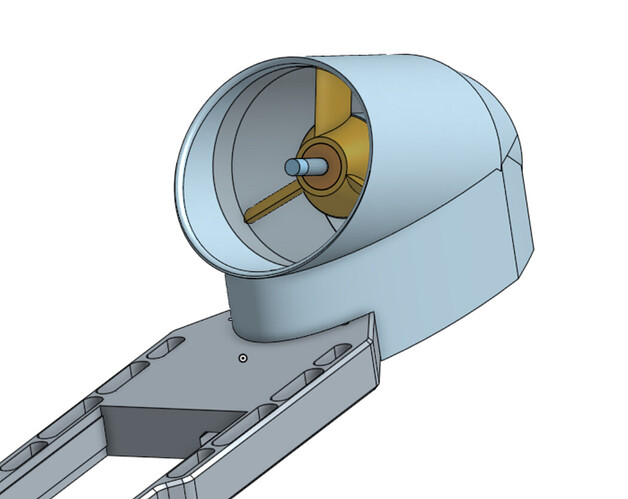 | 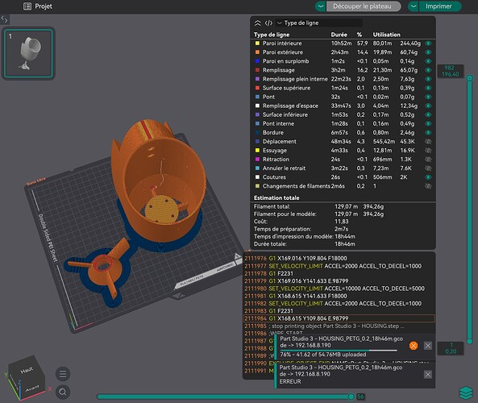 | 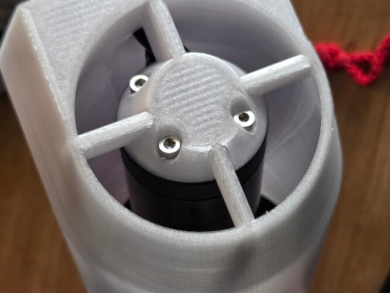 | 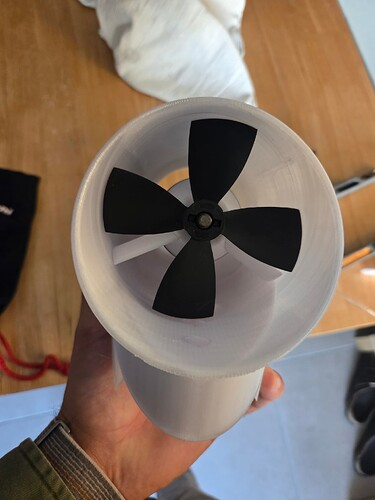 |

---

## 4. The 5085 motor path (context)

The turbine work follows directly from the 5085 motor swap, which cut ~400 g from
the V4 prop setup and gave the cleanest feel of all tested motors.

- **2026-05-12** — 5085 ordered (same motor as @foilstate's proven design).
- **2026-05-13** — V4 pod hacked to fit the 5085. Hub printed (PETG-GF cracked
  after one session → PPA/PA 100% infill hubs).
- **2026-05-16** — First 5085 test with unbalanced carbon prop + cotter pins:
  felt stronger than the maytech 6374, lower drag on pod touchdown, easy
  starts in small chop. (post [#220](https://foil.zone/t/24787/220))
- **2026-06-06** — Titanium blade set received (90 USD, alu + ti set). No post
  processing needed, edges sharper than alu. (post [#256](https://foil.zone/t/24787/256))
- **2026-06-15** — Ti prop test: perfect out of the box. 5085 + ti setup "very
  smooth, gets forgotten when pumping". Previous DW score passed on 15 kt
  tailwind + slow Saône current. Ti bolts + ti blades credited. (post [#261](https://foil.zone/t/24787/261))

5085 / Ti build photos:

| Hacked 5085 pod | First 5085 water test | Ti blade set |
| :--- | :--- | :--- |
| 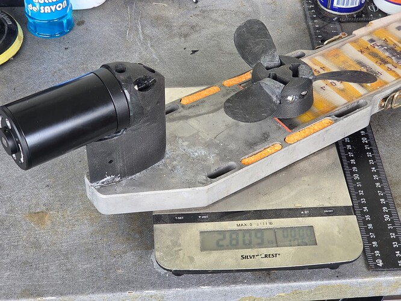 | 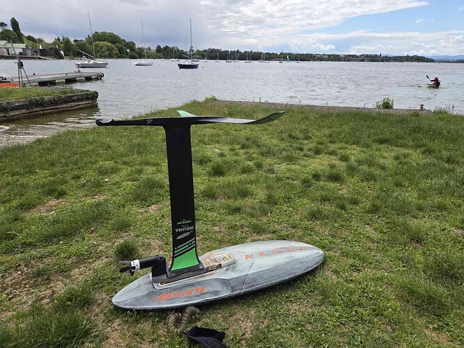 | 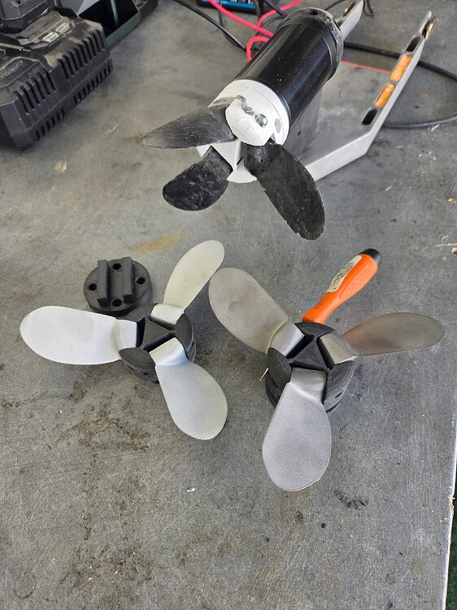 |

---

## 5. First water test — 13 Sept 2026

Results from the first dedicated jet test (post [#355](https://foil.zone/t/24787/355)):

- **System works.** Small board started a few times, but only with full battery.
- **Battery hammered**: 41 V / 65 A at full charge on 12S1P. 199 Wh is too small
  for this duty cycle. 12S2P is the fix.
- **Big board**: easy flying with some pumping. Transition to fully flying not easy.
- **Touchdown**: motor off = lot of drag (funnel brake). Motor spinning = drag much less noticeable.
- **Air intake**: confirmed very sensitive (post #354).
- **Balance**: no scraping or vibration felt.

Test screenshots (from the posted videos, [13 septembre 2026](https://www.youtube.com/watch?v=aBwcKk_be1A) and [End of battery](https://www.youtube.com/watch?v=OXS7Xq_WdP4)):

| Start on small board | Foiling with the jet | Flight, big board |
| :--- | :--- | :--- |
|  | 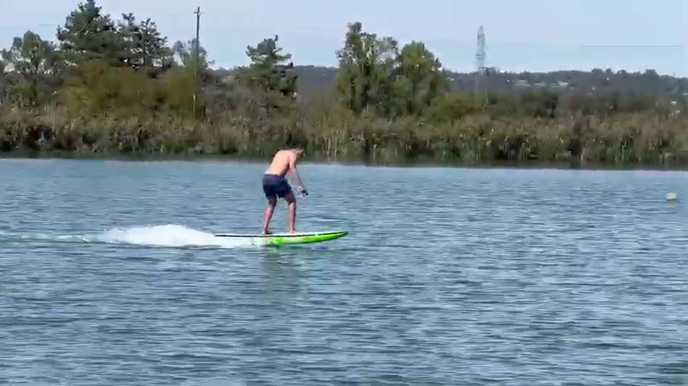 |  |

On-site photos from the test day (post #355):

| Jet test 1 | Jet test 2 |
| :--- | :--- |
| 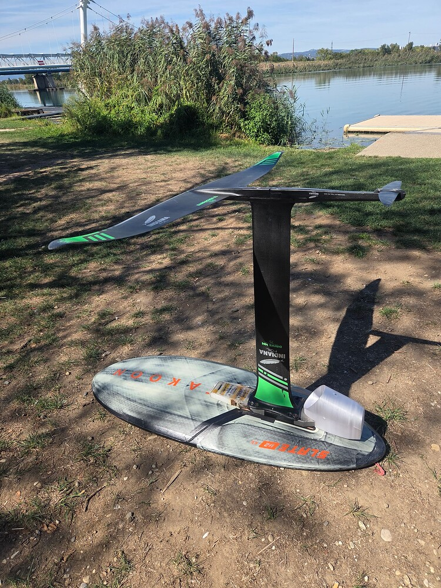 | 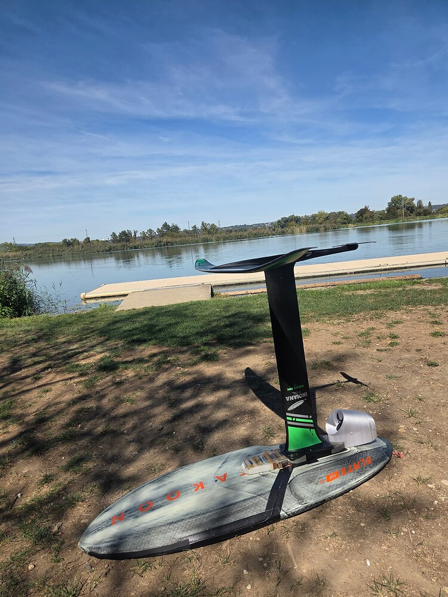 |

---

## 6. Dedicated S4 system concept v1 (17 Sept 2026)

Following the successful test jet, a dedicated in-board system was drafted
(post [#358](https://foil.zone/t/24787/358)):

- **Jet**: 95 mm 5080.
- **Battery**: 12S2P removable 21700. Sealed compartment that can be filled
  with a 4S1P + wires for airline travel (Wh limit).
- **Intake layout**: cartridge from the back of the board (Flite-style) or from
  the top as a reverse trench board. Vs Flite AMP: suction entry in front of
  the mast instead of the sides — easier to build, open question on touchdown
  suction effect.
- **Board**: dual plywood stringers on each side of the foil box, or strong
  carbon tube. Electronics on top of the unit for signal.
- **Open issues**: unit thickness (track clearance), board comfort + rigidity,
  touchdown/suction behavior in front of the mast.

Concept renders (post #358):

| Unit side view | Unit top view | Board integration |
| :--- | :--- | :--- |
| 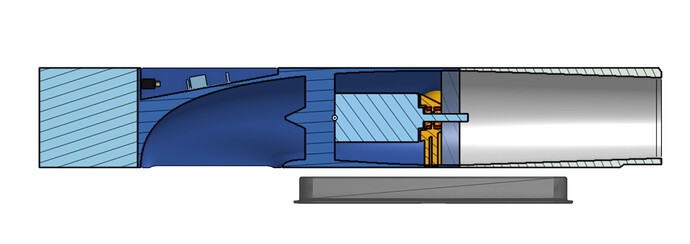 | 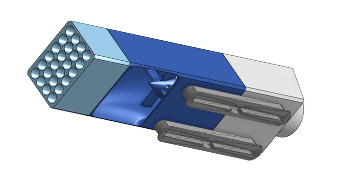 | 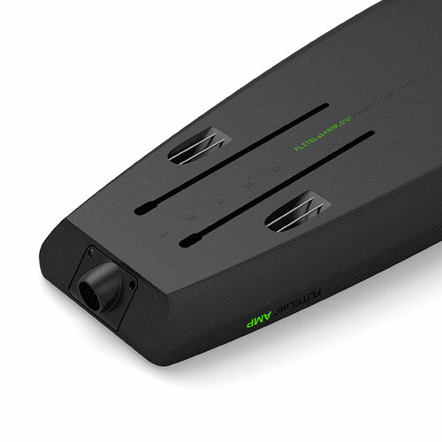 |

---

## 7. S4 board build (Oct 2026)

Board build started 2026-10-01 (post [#364](https://foil.zone/t/24787/364)):

- Blank: EPS 163 × 52 × 80 mm max thickness (limited by thick-blank availability).
- **No trench** — the board must also parawing in big conditions.
- Shaping in progress, dual stringer layout.

Glassing update 2026-10-05 (post [#368](https://foil.zone/t/24787/368)):

- Bottom glassed, wet lay (no vacuum, no peel ply).
- Laminate: 2 × 125 gr glass + 200 gr carbon patch top/bottom over the dual stringer.
- **Target board weight: ~4 kg.**

Build photos:

| Blank 1 | Blank 2 | Shaping 1 | Shaping 2 |
| :--- | :--- | :--- | :--- |
| 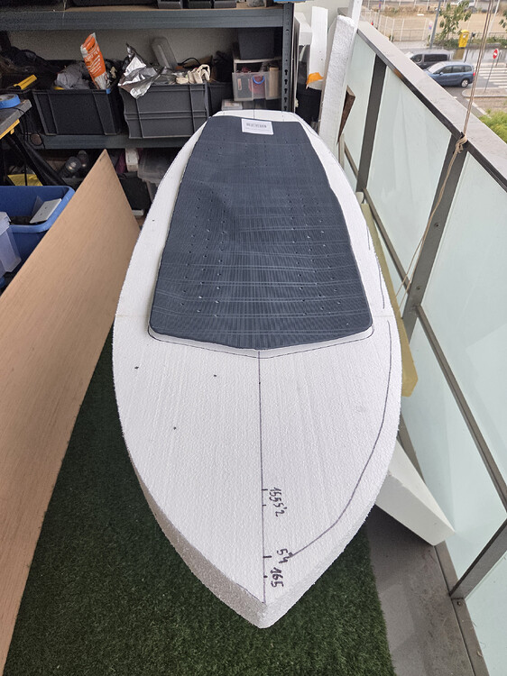 | 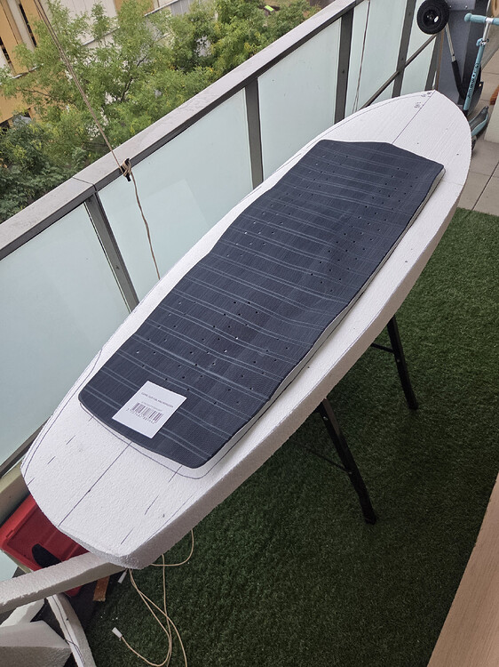 | 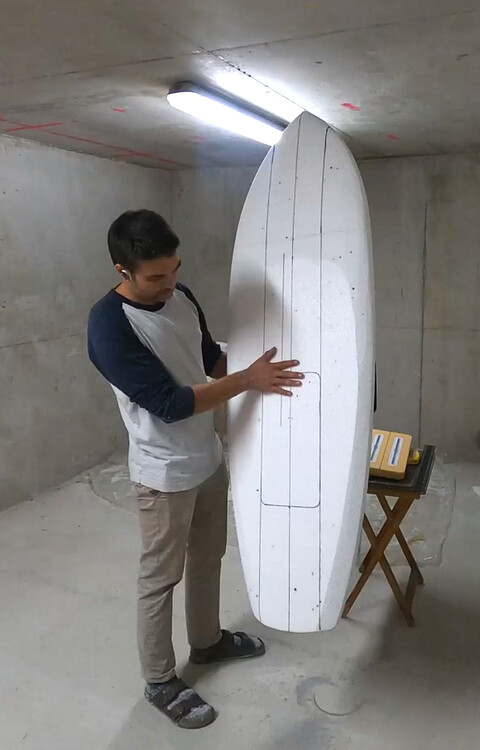 | 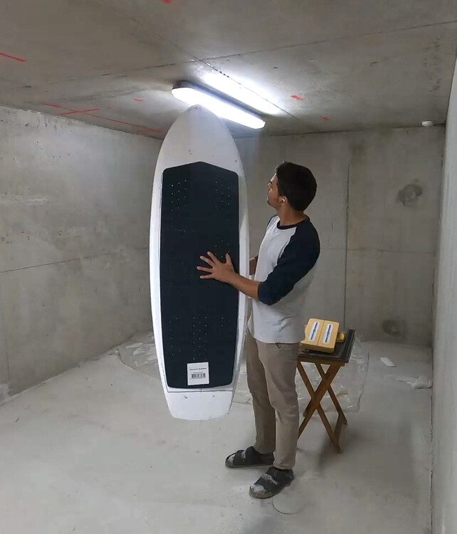 |

| Bottom glassed | Carbon patch |
| :--- | :--- |
| 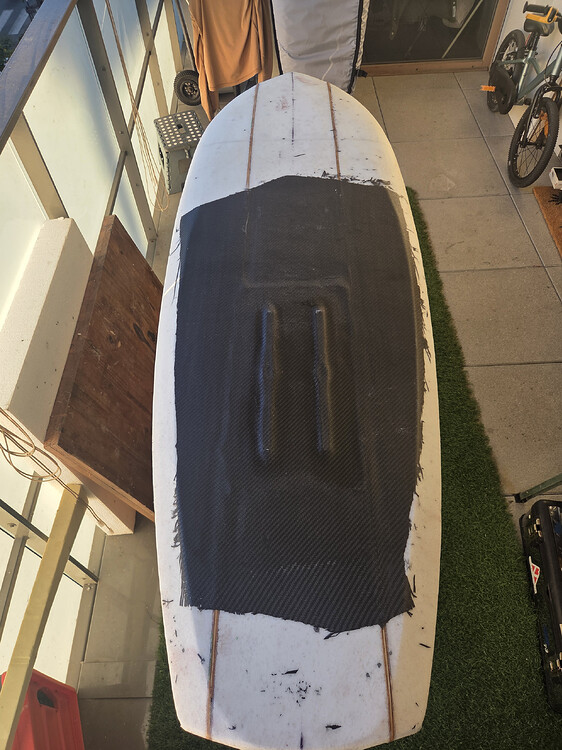 | 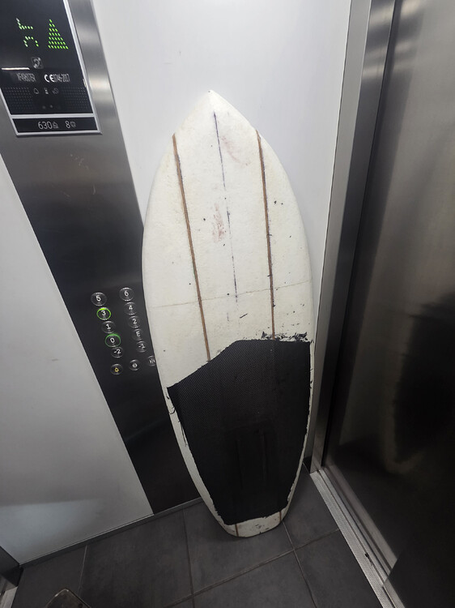 |

---

## 8. Known gaps (carried from research.md, updated by the tests)

1. **Prop pitch**: 95 mm too low for DW speed. Higher pitch impeller next.
2. **Air intake**: sensitive → shroud or redesigned intake.
3. **Touchdown drag**: motor-off funnel brake → gate or folding element study.
4. **Thermal**: 5080 at 65 A sustained, no active cooling → monitor.
5. **Pod retention**: pod lost in water (17 Aug 2026) → retention mechanism.
6. **Battery**: 199 Wh too small for 2.66 kW → 12S2P (398 Wh) or 16S1P.

---

## 9. Links

- S4 jet concept: https://foil.zone/t/light-assist-season-3/24787/345
- Angled intake + motor: https://foil.zone/t/light-assist-season-3/24787/348
- Air intake sensitivity: https://foil.zone/t/light-assist-season-3/24787/354
- First water test: https://foil.zone/t/light-assist-season-3/24787/355
- Test videos: https://foil.zone/t/light-assist-season-3/24787/356
  - [13 septembre 2026](https://www.youtube.com/watch?v=aBwcKk_be1A)
  - [End of battery](https://www.youtube.com/watch?v=OXS7Xq_WdP4)
- Dedicated system concept: https://foil.zone/t/light-assist-season-3/24787/358
- S4 board build: https://foil.zone/t/light-assist-season-3/24787/364
- Board glassing: https://foil.zone/t/light-assist-season-3/24787/368
- 5085 motor: https://foil.zone/t/light-assist-season-3/24787/208
- Ti blades: https://foil.zone/t/light-assist-season-3/24787/256
- Ti prop test: https://foil.zone/t/light-assist-season-3/24787/261
- Jet research (impellers, Flite AMP, CAD tools): [research.md](../research.md)
